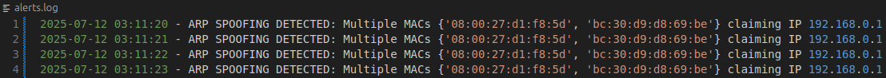
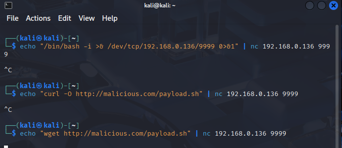

# 🛡️ Lightweight Network-based Intrusion Detection System for Purple Teaming Exercise 🟣

## 📘 Overview

This project is a lightweight, custom-built network-based Intrusion Detection System (IDS) designed to run on a victim machine within a VirtualBox homelab environment. It detects network attacks launched from an attacker machine (e.g., Kali Linux) and logs suspicious activity for analysis.

This setup simulates a **purple teaming** exercise, combining offensive and defensive cybersecurity techniques to deepen understanding of network security, attack vectors & detection, and incident response.

## 🎯 Project Goals

- 🏗️ Build a simple network IDS from scratch to detect basic attacks  
- 🧠 Gain hands-on experience with networking, packet analysis, and security monitoring  
- 💻 Setup and use a VirtualBox homelab for isolated attacker and victim machines  
- ⚔️ Practice offensive tactics (attacks from Kali) and defensive tactics (IDS detection & logging)  
- 🔍 Understand how to analyze logs and tune detection rules

## 🔍 Current Detection Capabilities

The IDS currently detects the following network activities:

- 🔁 **ARP Spoofing**
- 📡 **C2 Beaconing**  
- 🌊 **ICMP Flood**
- 💣 **Payload Strings** (e.g., known malicious payloads)
- 🔎 **Port Scans**
- 🔐 **SSH Brute Force**
- 🌊 **SYN Flood**
- 🌊 **TCP RST Flood**

## 🧪 Homelab Setup

- 🖥️ **Victim Machine:** Runs the custom IDS script monitoring network traffic and logging alerts  
- 🐉 **Attacker Machine:** Kali Linux, used to launch network attacks (e.g., ARP spoofing, port scans, SSH bruteforce)  
- 📦 **VirtualBox:** Hosts both VMs with configured internal networking  

## ✨ Features

- 🕵️ Lightweight packet sniffing and anomaly detection  
- 🗃️ Logging suspicious network events with timestamps  
- 🚨 Simple alert mechanism based on custom detection logic  
- 🔧 Modular code for easy extension and tuning  

## ▶️ Usage

1. 🟢 Launch the victim machine VM and start the IDS script  
2. 🔴 Launch the Kali Linux attacker VM  
3. 💣 Execute network attacks from Kali (e.g., `arping`, `nmap`, `reverse shells`) targeting the victim  
4. 📋 Observe IDS logs for detection alerts  
5. 📈 Analyze logs and tune detection parameters  

## 📦 Prerequisites

- 🖥️ VirtualBox installed  
- 🧑‍💻 Two VMs: Victim (Linux with Python), Attacker (Kali Linux)  
- 🐍 Python 3.x installed on the victim VM  
- 📚 Required Python packages (e.g., `scapy`) installed on victim VM  

## 🧪 Example Commands

- Start IDS:  
  ```bash
  python3 ids.py

## 📷 Screenshots

Here is the IDS in action - detections from running various attacks against the victim machine.

#### Machine configs

<p>
  
  
</p>


## 🛡️ Detection Logic Descriptions

### 🔁 ARP Spoofing Detection
- **What the attacker does**: Sends fake ARP responses to a victim to associate the attacker’s MAC address with the gateway’s IP, effectively becoming a man-in-the-middle.
- **What it achieves**: Allows the attacker to intercept, modify, or block traffic between hosts.
- **What the IDS detects**: Multiple MAC addresses claiming to own the same IP (usually the gateway), indicating spoofing.

#### Attack


#### IDS - log output



---

### 📡 C2 Beaconing Detection
- **What the attacker does**: Deploys malware or a backdoor that periodically connects back ("phones home") to a command-and-control (C2) server.
- **What it achieves**: Establishes control over the compromised host, allowing remote commands, data exfiltration, etc.
- **What the IDS detects**: Repeated, timed outbound connections to the same IP/port (e.g., every 5 seconds), a hallmark of beaconing.

#### Attack

1. SSH bruteforce to get the password
2. SSH into the victim machine

<p>
  
  
</p>

3. Establish a reverse shell


#### IDS - log output


---

### 🌊 ICMP Flood Detection
- **What the attacker does**: Sends a large number of ICMP Echo Request (ping) packets to the target.
- **What it achieves**: Aims to overwhelm the network stack or consume bandwidth, potentially causing denial of service.
- **What the IDS detects**: A high volume of ICMP packets in a short time window from a single source.

#### Attack


#### IDS - log output


---

### 💣 Payload Strings Detection
- **What the attacker does**: Injects known malicious commands or payloads (e.g., `nc -e`, `curl`, `wget`, `/bin/bash`) into network traffic.
- **What it achieves**: Attempts to execute commands, download malware, or create reverse shells on the victim.
- **What the IDS detects**: Known suspicious keywords or byte patterns in raw packet payloads.

#### Attack



#### IDS - log output


---

### 🔎 Port Scan Detection
- **What the attacker does**: Probes a range of ports on the victim to discover open services (e.g., via `nmap`).
- **What it achieves**: Gathers reconnaissance to plan further exploitation.
- **What the IDS detects**: A single source attempting connections to many different ports on the target within a short period.

#### Attack


#### IDS - log output


---

### 🔐 SSH Brute Force Detection
- **What the attacker does**: Rapidly attempts many username/password combinations against SSH (port 22).
- **What it achieves**: Tries to gain unauthorized shell access via credential stuffing or brute force.
- **What the IDS detects**: Numerous SSH connection attempts or failed login attempts from a single source IP.

#### Attack

<p>
  
  
</p>

#### IDS - log output


---

### 🌊 SYN Flood Detection
- **What the attacker does**: Sends a flood of TCP SYN packets (start of handshake) without completing the connection.
- **What it achieves**: Consumes resources on the victim (e.g., half-open connections), leading to denial of service.
- **What the IDS detects**: A large number of SYN packets from one source without corresponding ACKs.

#### Attack


#### IDS - log output


---

### 🌊 TCP RST Flood Detection
- **What the attacker does**: Sends a flood of TCP RST (reset) packets to active connections.
- **What it achieves**: Forces connections to close prematurely, potentially disrupting services or communication.
- **What the IDS detects**: An unusual number of TCP RST packets from one source to many destinations or sessions.

#### Attack


#### IDS - log output


  
